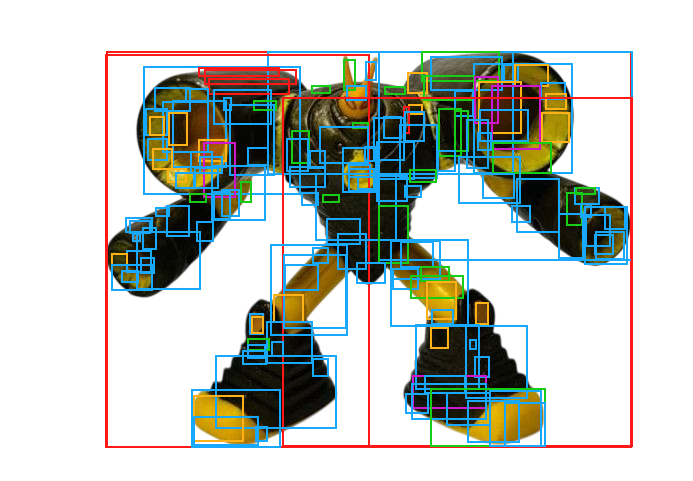
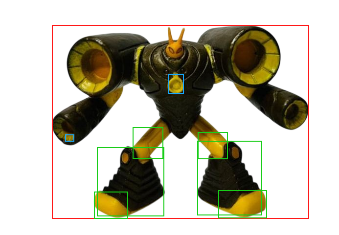
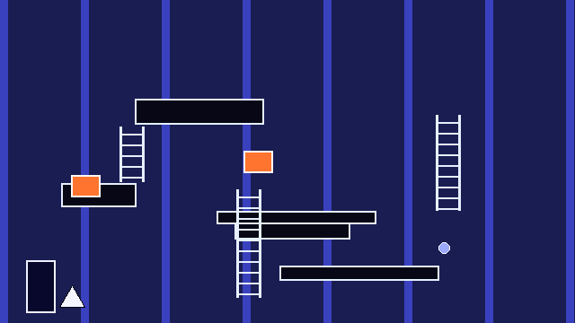
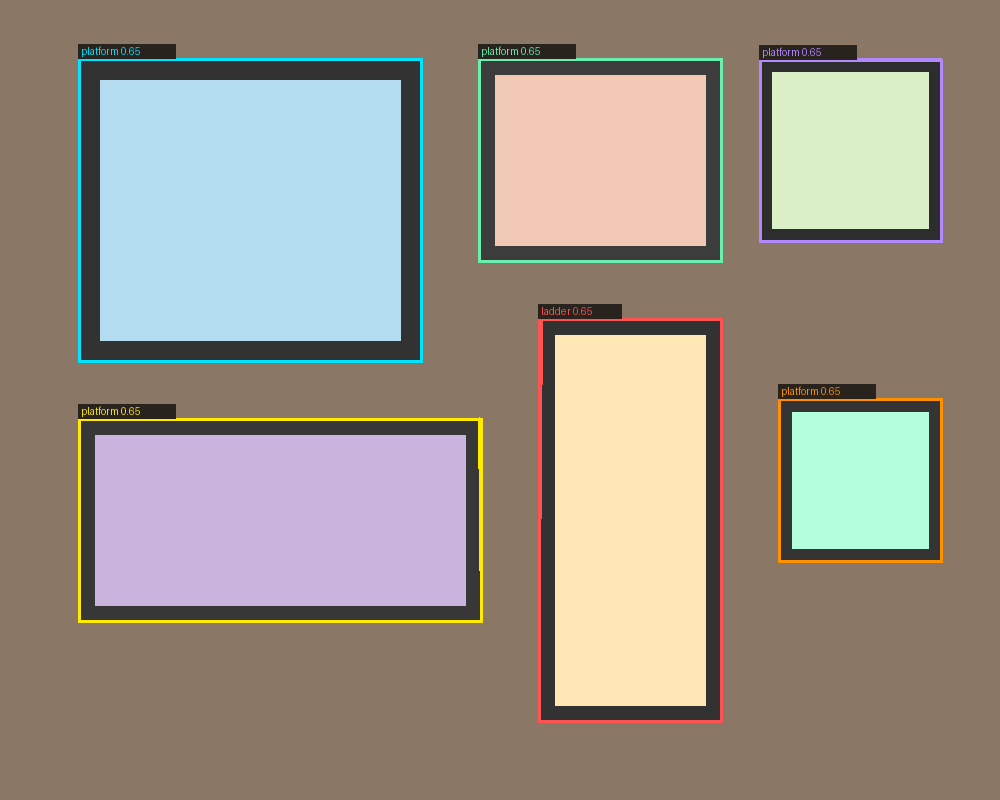

<div align="center">

# GVI: Godot Vision Orchestrator

**Learned scene-graph reconstruction from raster and vector assets, targeting the Godot 4 engine.**

[]()
[]()
[]()
[]()

</div>

> [!NOTE]
> **Project status: active research, training-ready, pre-production.**
> This is not a finished product; it is an evolving research codebase with an
> honest, continuously audited verification ledger (see
> [§5 Verification status](#5-verification-status-the-empirical-ledger)).
> Claims here are scoped to what was actually executed, not what the code is
> theoretically capable of. Treat anything marked ⚠️ or ❌ as an open problem,
> not a defect to be silently assumed fixed.

---

## Abstract

GVI reconstructs an **editable, semantically structured Godot 4 scene** from a
flattened input asset such as a screenshot, a concept-art frame, or a design
mockup. The work rests on three ideas:

- **The task is program synthesis, not segmentation.** The target is not a
  caption or a mask but a typed, hierarchical document (a Godot `.tscn` scene
  graph) that must satisfy *hard structural constraints* (valid resource
  references, correct node types, well-formed tile data) alongside *soft
  perceptual ones* (visual fidelity to the source).

- **A typed, plugin-composed pipeline beats an end-to-end model.** Each stage
  (detection, parsing, segmentation, OCR, hierarchy inference, theme and style
  extraction, tilemap synthesis) operates over a shared intermediate
  representation (IR), and is independently swappable, testable, and degrades
  deterministically when its preferred backend (YOLO, SAM 2, Grounding DINO,
  EasyOCR) is unavailable.

- **Domain labels come from a teacher/student loop.** Because COCO's 80 classes
  are close to irrelevant for game and UI assets, a second subsystem
  (`gvi/training/`) has zero-shot vision-language teachers (Grounding DINO +
  SAM 2) bootstrap labels for a lightweight YOLO11-seg student, with human
  review gating every label that fails a deterministic business-rule check
  before it reaches training data.

<div align="center">
<table>
<tr>
<td width="50%"></td>
<td width="50%"></td>
</tr>
<tr>
<td align="center"><b>v1.0.0: 157 components</b><br><sub>chaotic over-segmentation; each highlight, screw, and gradient band becomes its own node</sub></td>
<td align="center"><b>v1.1.1: 9 components</b><br><sub>clean, semantically meaningful regions after two execution-found bug fixes</sub></td>
</tr>
</table>
</div>

> **Figure 1.** Adaptive OpenCV segmentation on the `robot_photo` benchmark
> (`test_images/robot_photo.png`). The component count dropped 157 → 30 → **9**
> across releases, *not* by blind threshold retuning but by debugging two
> concrete defects that surfaced only when the full pipeline was run
> end-to-end. This is the headline empirical result of §5, and the overlays are
> reproducible from the committed `docs/proof_overlays/` assets.

---

## Table of contents

| # | Section | # | Section |
|---|---------|---|---------|
| 1 | [Problem statement](#1-problem-statement) | 7 | [Training subsystem](#7-the-training-subsystem-teacherstudent-active-learning) |
| 2 | [System architecture](#2-system-architecture) | 8 | [Output guarantees](#8-output-guarantees) |
| 3 | [Methodology](#3-methodology) | 9 | [Testing methodology](#9-testing-methodology) |
| 4 | [Installation](#4-installation) | 10 | [Licensing](#10-licensing) |
| 5 | [Verification status](#5-verification-status-the-empirical-ledger) | 11 | [Roadmap](#11-roadmap--open-problems) |
| 6 | [Usage examples](#6-usage-examples) | 12 | [Citation](#12-citation) |

---

## 1. Problem statement

Given an input asset $x$ (a raster image, SVG, PDF page, or PSD document) and a
target node taxonomy $T$ (e.g. `godot.node2d`, `godot.control`,
`godot.tilemap`), produce a Godot 4 scene description $S = f(x, T)$ that
satisfies three properties:

- **Structural validity.** $S$ parses as a well-formed `.tscn`/`.tres` resource
  graph under Godot 4's grammar (single header, declared `ext_resource`s, valid
  node types).
- **Semantic fidelity.** The node hierarchy of $S$ reflects the perceptual
  grouping a human would assign to $x$ (panels contain their children, repeated
  tiles collapse to a `TileMapLayer`, text regions become editable
  `Label`/`RichTextLabel` nodes).
- **Perceptual fidelity.** Re-rendering $S$ approximates $x$ under SSIM, PSNR,
  and IoU metrics (`validator.scene`).

This is harder than either pure image segmentation (no engine-grammar
constraint) or pure program synthesis from spec (no perceptual grounding).
GVI's working hypothesis is that **decomposing the problem into a typed
pipeline of narrow, independently verifiable stages** generalizes better than
an end-to-end learned model, at the cost of requiring real integration testing
of the *seams*, which is exactly where most of the bugs documented in §5 were
actually found.

---

## 2. System architecture

| Package | Responsibility |
|---------|----------------|
| `core/` | orchestrator, planner, registry, plugin contracts, typed IR |
| `ir/` | intermediate representation schema (pydantic) |
| `llm/` | optional LLM vision guide (semantic hints, not required) |
| `ocr/` | EasyOCR text extractor |
| `postprocess/` | hierarchy_builder, theme_extractor, tilemap_builder |
| `api_server/` | FastAPI REST app and stdio MCP-style tool server |
| `plugins/detectors/` | `asset_probe`: format, dimensions, alpha |
| `plugins/parsers/` | `svg`, `pdf`, `psd`: structured-input fast paths |
| `plugins/analyzers/` | `raster_heuristics`, `spritesheet` |
| `plugins/segmenters/` | `yolo` (semantic), `sam2`, `opencv` (deterministic fallback) |
| `plugins/exporters/` | `godot_scene`, `godot_tileset` |
| `plugins/validators/` | `scene_validator` (SSIM/PSNR/IoU), `godot_headless` (real-engine check) |
| `training/` | taxonomy, annotations, autolabel, YOLO export, active learning, train/evaluate/predict, synthetic data |

The **Orchestrator, Planner, and Registry** triad resolves, at run time, which
concrete plugin satisfies each abstract pipeline stage for a given input
profile and requested target. For example, an SVG input skips the segmenter
entirely, and a request without GPU or torch falls back from `segmenter.sam2`
to the pure-OpenCV `segmenter.opencv` engine with no code change at the call
site. This registry-based capability resolution is the architectural answer to
a recurring failure mode in vision pipelines: silent degradation when an
optional dependency is missing. Here, degradation is explicit, logged, and
exercised by tests (see the `godot_headless` "binary not found" test case).

---

## 3. Methodology

The conversion pipeline executes as an ordered DAG of capability-tagged stages:

| # | Stage | Role |
|---|-------|------|
| 1 | `detector.asset_probe` | Format, dimensions, alpha-channel detection |
| 2 | `parser.{svg,pdf,psd}` | Structured-input fast path (skips segmentation) |
| 3 | `analyzer.raster_heuristics` | Text / UI / pixel-art classification |
| 4 | `analyzer.spritesheet` | Grid-layout detection |
| 5 | `segmenter.yolo` | Semantic instance segmentation and class labels (opt-in) |
| 6 | `segmenter.sam2` / `segmenter.opencv` | Zero-shot masks, GPU or CPU fallback |
| 7 | `ocr.easyocr` | Editable text regions |
| 8 | `postprocess.hierarchy` | Group children under panels (tree inference) |
| 9 | `postprocess.theme` | Palette and font extraction |
| 10 | `postprocess.tilemap` | Tile slicing and atlas construction |
| 11 | `exporter.godot.scene` | Emit `scene.tscn` |
| 12 | `exporter.godot.tileset` | Emit `tile_set.tres` |
| 13 | `validator.scene` | SSIM / PSNR / IoU and geometry checks |

Each stage is a `gvi.core.plugin` implementation registered against a typed
contract. This is what makes per-stage unit testing and per-stage fallback
possible, and is the reason the codebase carries two distinct test layers (§9)
rather than one end-to-end smoke test.

---

## 4. Installation

```bash
# Core (deterministic OpenCV pipeline, no ML deps)
python -m pip install -e .

# All optional extras
python -m pip install -e ".[full]"

# A la carte
python -m pip install -e ".[api, sam2, yolo, ocr, pdf, svg, psd]"

# Training subsystem (YOLO student plus heuristic / HF teachers)
python -m pip install -e ".[training]"

# High-quality zero-shot teacher (Grounding DINO + SAM 2 via transformers)
python -m pip install -e ".[hf]"
```

Model weights auto-download to `~/.cache/gvi/models/` on first use. No network
access is required for the core OpenCV path.

---

## 5. Verification status (the empirical ledger)

This table is the project's primary research artifact: every claim is labeled
with the evidence behind it, not its intended behavior. It is updated per
release; see `docs/CHANGELOG_*.md` for the full account of what was run and
what broke.

| Component | Status | Evidence |
|-----------|--------|----------|
| OpenCV adaptive segmentation | ✅ verified, re-measured across releases | Robot photo regression: 157 → 30 → **9** components (see Figure 1), across two real bugs found by execution, not static review |
| Full Orchestrator pipeline (E2E) | ✅ verified by execution | 7 test images × 7 targets via the real Orchestrator/Planner/Registry stack (offline shim, see `offline_test_shims/README.md`) |
| Quality-gate regression test | ✅ verified, passing, tightened | 13 cases, `tests/test_segmentation_quality_gate.py` |
| Homography rectification (tilted quads) | ✅ verified on synthetic data | No real tilted-photo ground truth available yet |
| GrabCut boundary refinement | ✅ verified on synthetic data | Real flattened-photo validation pending |
| Godot-headless validation hook | ✅ subprocess logic verified; real Godot unconfirmed | 3 tests (clean exit, parse-error, binary-not-found); none prove real Godot 4 acceptance |
| YOLO semantic segmentation | ⚠️ disabled by default | COCO's 80 classes have near-zero relevance to game/UI assets; opt-in only |
| Training: heuristic teacher | ✅ verified by execution | Contour/geometry-based bootstrap labels, end-to-end run |
| Training: HF teacher (Grounding DINO + SAM 2) | ⚠️ code path verified offline with injected fake models; real inference **not yet run** | See `docs/CHANGELOG_v1.3.md`; needs GPU, network, and real weights |
| Training: YOLO student trainer | ⚠️ `--dry-run` verified (emits correct `yolo segment train` invocation); real run not executed in this audit | Needs GPU |
| SAM 2 segmentation (inference pipeline) | ❌ not re-verified this cycle | Requires torch and model weights, untestable offline |
| EasyOCR text extraction | ❌ not re-verified this cycle | Same constraint |
| TileSet/.tres, theme/hierarchy postprocessors | ❌ not re-verified this audit | Exercised indirectly via `godot.node2d` E2E run only |

**Reading guide.** ✅ means executed and observed. ⚠️ means the code path was
exercised but the key claim (real model quality, real engine acceptance) is
unconfirmed. ❌ means not exercised this cycle, status unknown until run. This
is a deliberate departure from typical README optimism: the cost of an inflated
claim here is a broken downstream training run, not just a bad demo.

---

## 6. Usage examples

```bash
# Inspect any asset before converting (always do this first)
python -m gvi.cli inspect path/to/your.png

# Convert to a Godot 4 scene
python -m gvi.cli convert path/to/your.png \
    --target godot.control \
    --preset balanced \
    --ocr \
    --out outputs/my_scene

# Result: a complete, openable Godot project
#   outputs/my_scene/scene.tscn                <- open in Godot, it just works
#   outputs/my_scene/tile_set.tres             <- for tilemap target
#   outputs/my_scene/theme.tres                <- for theme target
#   outputs/my_scene/gvi_layer_controller.gd   <- for animation target
#   outputs/my_scene/assets/*.png              <- transparent element cutouts
#   outputs/my_scene/manifest.json             <- full element manifest

# Validate a generated scene against its source image
python -m gvi.cli validate outputs/my_scene/scene.tscn --source path/to/your.png

# REST API
python -m pip install -e ".[api]"
python -m gvi.cli serve --host 0.0.0.0
#   POST /convert   (multipart: file, target, preset, sam2, ocr, ...)
#   POST /inspect
#   GET  /health

# MCP-style stdio tool server (for agentic / LLM-driven workflows)
echo '{"id":1,"method":"tools/call","params":{"name":"gvi.inspect","arguments":{"path":"my.png"}}}' \
  | python -m gvi.cli mcp
```

**Targets at a glance**

| `--target` | Root node | Use case |
|------------|-----------|----------|
| `godot.node2d` | `Node2D` | Game scene, sprites, props |
| `godot.control` | `Control` | UI reconstruction (buttons, labels) |
| `godot.sprite2d` | `Node2D` | Pure sprite layer stack |
| `godot.tilemap` | `Node2D` | + `TileMapLayer` referencing `tile_set.tres` |
| `godot.richtext` | `Control` | Rich-text label, all detected text |
| `godot.theme` | `Control` | + `theme.tres` (palette and styleboxes) |
| `godot.animation` | `Node2D` | + `AnimationPlayer` and helper script |

---

## 7. The training subsystem: teacher/student active learning

GVI's vision components were trained on COCO, a distribution with almost no
overlap with platformer tiles, UI chrome, or pixel-art sprites. Rather than
fine-tune blind, `gvi/training/` implements a **zero-shot teacher → human-gated
review → lightweight student** loop.

<div align="center">
<table>
<tr>
<td width="50%"></td>
<td width="50%"></td>
</tr>
<tr>
<td align="center"><b>Figure 2.</b> <sub>A procedurally generated synthetic platformer frame (<code>gvi training synthetic</code>): platforms, ladders, pickups, and hazards with known ground-truth geometry, letting the student train before a single real image is collected.</sub></td>
<td align="center"><b>Figure 3.</b> <sub>Teacher auto-label output (<code>gvi training autolabel</code>): each region carries a predicted class (<code>platform</code>, <code>ladder</code>) and confidence. Labels below threshold or failing a geometry rule are routed to human review, not silently trusted.</sub></td>
</tr>
</table>
</div>

The loop, stage by stage:

```bash
# 1. Scaffold a dataset in YOLO-segmentation layout
gvi dataset init --type platformer ./dataset

# 2. Bootstrap with synthetic data (train without collecting a single image)
gvi training synthetic --dataset ./dataset --count 80 --split train
gvi training synthetic --dataset ./dataset --count 20 --split val

# 3. Auto-label real images with a teacher backend
#    heuristic   -> offline, geometry-based, bootstrap-only
#    yolo        -> an existing YOLO-seg checkpoint
#    huggingface -> Grounding DINO + SAM 2, local, zero-shot, open-vocabulary (recommended)
#    grounded-sam-> HTTP endpoint, for an externally hosted teacher
gvi training autolabel ./dataset/raw --dataset ./dataset --backend huggingface \
    --classes platform --classes ladder --classes spike --classes door \
    --classes enemy --classes pickup --conf 0.30

# 4. Every label passes a deterministic business-rule gate (score_object),
#    e.g. a horizontal "ladder" candidate is demoted to needs_review.
#    Human review surfaces exactly the flagged subset:
gvi training review ./dataset --cvat

# 5. Train the lightweight student
gvi training train ./dataset --model yolo11n-seg.pt --epochs 80 --imgsz 640 --batch 8
```

This loop is deliberately scoped: no Hugging Face `datasets`/Hub integration
and no experiment-tracking dependency (DVC, MLflow, W&B) have been added,
because at the current dataset scale (hundreds of images) they add dependency
surface without solving a real problem yet. See `docs/TRAINING_ROADMAP.md` for
when that calculus is expected to flip.

**Further reading:** `docs/TRAINING.md`, `docs/ANNOTATION_GUIDE.md`,
`docs/TEACHER_BACKENDS.md`, `docs/HF_TEACHER.md`.

---

## 8. Output guarantees

Every generated `scene.tscn`:

- Has exactly one `[gd_scene ...]` header.
- Declares every `ext_resource` it references.
- Uses correct Godot 4 node types (`Sprite2D`, `TextureRect`, `Label`,
  `Button`, `Panel`, `TileMapLayer`, `AnimationPlayer`, `Control`, `Node2D`).
- Uses Godot-4-correct `layout_mode`, `offset_*`, and `position` conventions.
- References assets as `res://assets/<file>`, relative to the project root.

Every generated `tile_set.tres`:

- Has exactly one `[resource]` block.
- Uses one `TileSetAtlasSource` sub-resource with one alternative per tile.
- Carries full-tile collision polygons on layer 0.
- References the atlas at `res://assets/tilemap_atlas.png`.

---

## 9. Testing methodology

```bash
python -m pip install -e ".[dev,full]"
python -m pytest tests/
```

Two intentionally separate layers, because they verify different things and
have different dependency costs:

- **Layer 1: pydantic-free core** (`tests/test_segmentation_quality_gate.py`,
  13 cases). Imports only `gvi.plugins.segmenters._opencv_core`; runs with just
  `opencv-python-headless`, `numpy`, and `Pillow`, even before `pip install -e .`
  has been run. This is the fast, dependency-light smoke layer.
- **Layer 2: full orchestrator stack** (`tests/test_pipeline.py`,
  `tests/test_tscn_validity.py`, 28 cases). Exercises the complete typed
  plugin/orchestrator pipeline end-to-end: 21 conversions (3 images × 7
  targets), 1 inspect round-trip, strict `.tscn`/`.tres` structural validators,
  and target-specific node-type assertions.
- **Training layer** (`tests/test_training_system.py`, 8 cases). Covers
  taxonomy/annotation schema, the heuristic teacher, and the HF teacher's
  prompt construction and mask-to-polygon conversion against *injected fake*
  Grounding DINO and SAM 2 engines; these tests verify code paths, not model
  quality (see §5).

A pre-commit or CI policy worth adopting going forward: every PR that touches
`plugins/segmenters/` or `training/hf_teacher.py` should re-run Layer 1 at
minimum, since both layers have historically caught real, distinct regressions
(see `docs/CHANGELOG_v1.1.md`, `docs/CHANGELOG_v1.2.1.md`).

---

## 10. Licensing

Core code is **MIT**. Some optional extras (`ultralytics`, `PyMuPDF`) are
**AGPL-3.0 / commercial dual-licensed**, not MIT. Read `NOTICE_LICENSING.md`
before publishing a fork or operating this as a public service with the
`yolo`/`sam2`/`pdf`/`full` extras enabled. `parser.pdf` also emits this as a
runtime warning on every invocation, not only as documentation.

---

## 11. Roadmap / open problems

From `docs/TRAINING_ROADMAP.md`, in expected order of tackling:

- **Near-term:** direct CVAT import/export, COCO export/import, and converting
  YOLO predictions directly back into GVI's scene IR (closing the
  label-to-reconstruction loop).
- **Mid-term:** dataset versioning (DVC) and experiment tracking (MLflow, W&B)
  once dataset scale justifies the dependency.
- **Long-term / research-grade:** fine-tuning Grounding DINO and Florence
  prompts on domain data; per-domain specialist models (platformer, UI,
  top-down, pixel-art); automatic Godot collision-shape validation; and
  human-in-the-loop correction as a Godot editor plugin rather than an external
  review file.

Items not on this list (SAM 2 and EasyOCR real-model re-verification, real
Godot-engine acceptance testing) are tracked in §5, not here, because they are
verification debt on existing claims rather than new capability.

---

## 12. Citation

If this codebase or its teacher/student labeling methodology is useful in your
own work, please cite the repository:

```bibtex
@software{gvi2026,
  title  = {GVI: Godot Vision Orchestrator},
  author = {Nana, Christian},
  year   = {2026},
  url    = {https://github.com/Txchrixo/gvi},
  note   = {Active research codebase, v1.3.0}
}
```

---

<div align="center">
<sub>Author and maintainer: Christian Nana (<a href="https://github.com/Txchrixo">@Txchrixo</a>). Contributions welcome via issues and pull requests.</sub>
</div>
